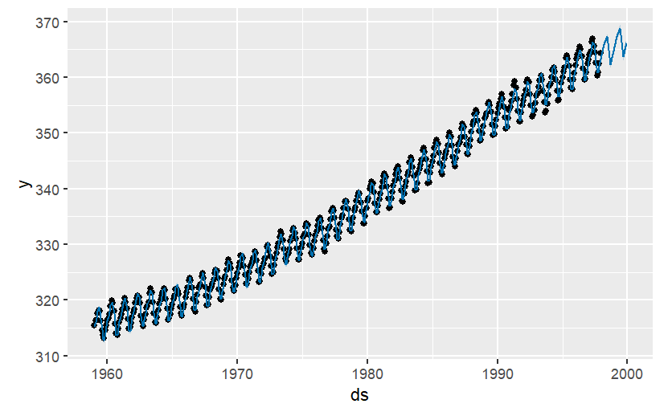
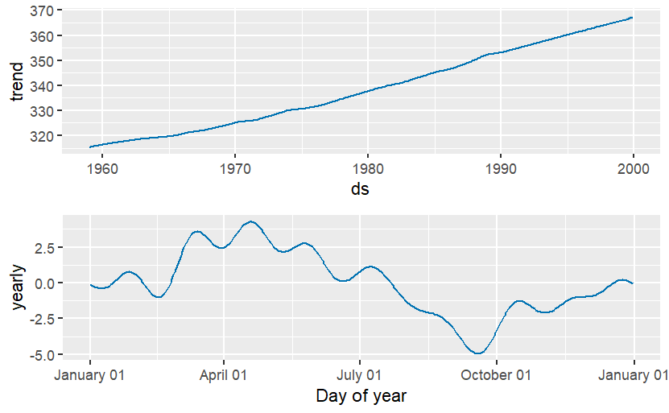

# C02 Forecasting in R using Prophet
This project applies **time series forecasting** in R to predict future atmospheric C02 concentrations using the **Prophet** library.

The goal is to show how forecasting models can capture **trend and seasonality** in time series data.

## Project Overview
 - Dataset: Built-in R dataset `co2` (monthly atmospheric CO2 from Mauna Loa Observatory, 1958–1997)
 - Model: **Meta Prophet** for time series forecasting  
- Key Steps:
  1. Prepare the dataset (`ds` = time, `y` = CO2 levels)  
  2. Fit a Prophet forecasting model  
  3. Create a future dataframe (quarters ahead)  
  4. Forecast and visualize results

## Results
- The forecast shows a **continuing upward trend** in CO2 concentration  
- Seasonal pattern detected:
  - Increase in **spring (April–May)**  
  - Decline in **autumn (Sept–Oct)**  
- Prophet outputs include:
  - Forecast plot (actual vs predicted values)  
  - Trend + seasonality components

## Forecast Plot 
Here is the CO2 forecast generated using Prophet:



Here we can plot the dates against the co2 concentration and the graph shows the predicted part for future using the forecast values. 
The blue line here shows the predicted values that prophet has produced.The black line is the original data.The graph shows that carbon dioxide concentration has been increasing however there is a lot of noise.

## Forecast Components
Trend and seasonality of the CO2 forecast:



Here we can get more plots that show the trend and yearly seasonality of the forecast.
The trend shows that there has been a rough increase of co2 by 40 ppm. 
The yearly seasonality shows that in the first half of the year, especially in April there is a large increase before a drastic drop in late September

## How to Run
1. Clone this repo  
2. Open `co2_forecast.R` (or `.Rmd`) in RStudio  
3. Install dependencies:
   ```r
   install.packages(c("prophet", "zoo"))
   ```
